Designing a Real Time Control System based on Django, ZMQ and WebSockets
========================================================================

----

$ whoami
========

* Python advocate for +6 years
* Head of practical assignments at **Univerisdad Nacional de la Patagonia**
* Devop at **Machinalis**

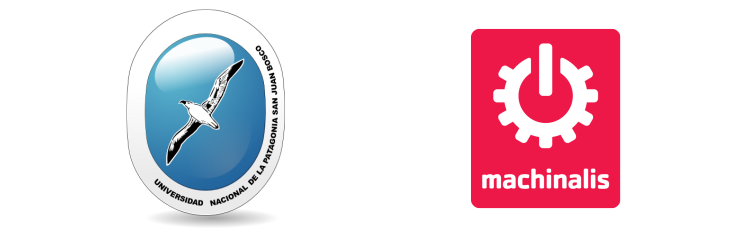

----

The SMVE project
================

This talk will cover the SVME project, an attemp to build
an UI (HMI) for a Power Substation monitoring system using HTML5 (SVG, WebSockets)
and Python in a lab at University where I work.

Software is *not finished* though it's quite functional.

----

Power distribution
==================

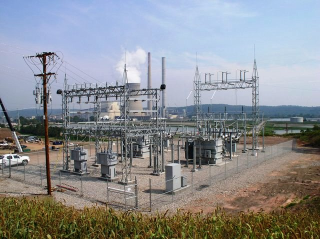

----

HMI
===

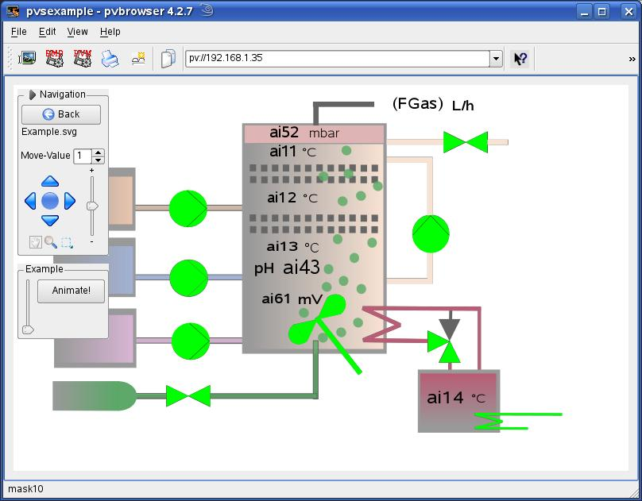

----

Python really?
==============================================

At first Python was seen as a very high level language, in an enviroment where
C and specific assembler were predominant.

But as complexity raises, Python is a **grat tool for this job**.

----

We were not the first!
======================

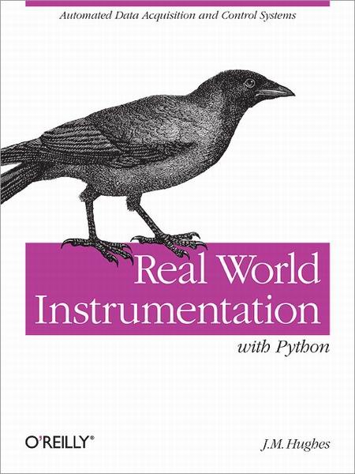

----

Why Django
==========

* Settings (with logging)
* Commands
* Easy to learn ORM (with Signals)

----

Where do data come from?
========================

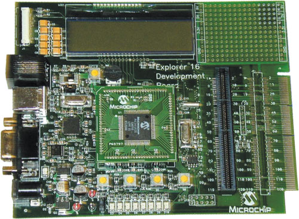

----

Measurement
===========

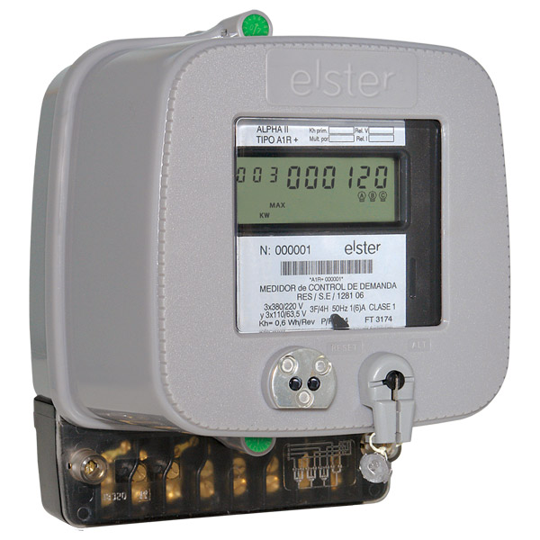

-----

IEDs
====

Power station have already **their** measurement equipment,
so you've got to figure out how to take talk to them.
Some devices can do **optical**, others **RS485**, but generally They are only capable of **one-to-one communication**.

So we built an interfase to poll every device in a network
under Mara, and we called it **IED**.

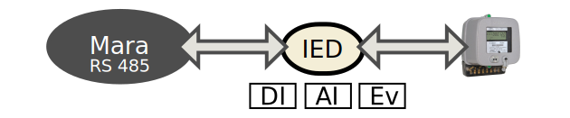

----

IED Network
===========

IEDs are built with very basic hardware, they have limited
memory and they communicate through Mara over RS485. They
measure **digital inputs**, **analog input** and **events**.

To take data out of these devices we need some kind of
gateway.

----

Concentratos
============

A Cocentrator is an IED with larger computing power
and Ethernet port, so it can talk Mara/485 with the
IED network and Mara/TCP-IP to the computer.

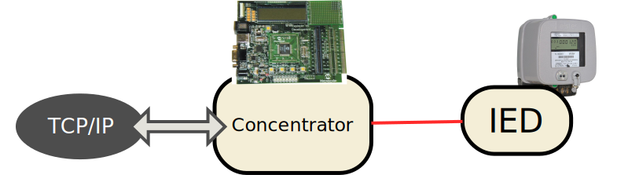

----

Concentrators also...
=====================

* Poll every IED connnected to it and store its **AI**, **DI**, **Events** in
  internal tables (data buffering).
* Synchronize their clock (from the PC or from external GPS)
* Gateway TCP-IP/485 for direct access to IEDs (i.e. PC broadcast).
* System status variables
* Communication status variables

-----

SCADA Deamon
============

The SCADA deamon polls every concentrator over TCP/IP.

It talks to the concentrators using **Twisted** for protocol management
and **Construct** for dict to stream/stream to bits conversion.

It talks to the database through **Django models**.

It's implemented as a **django management command**.

-----

Django Models
=============

* Concentrator
    * IED
        * DI
        * AI
        * Events

----

How do I run it?
================

        .. code-block:: bash

            python manage.py poll

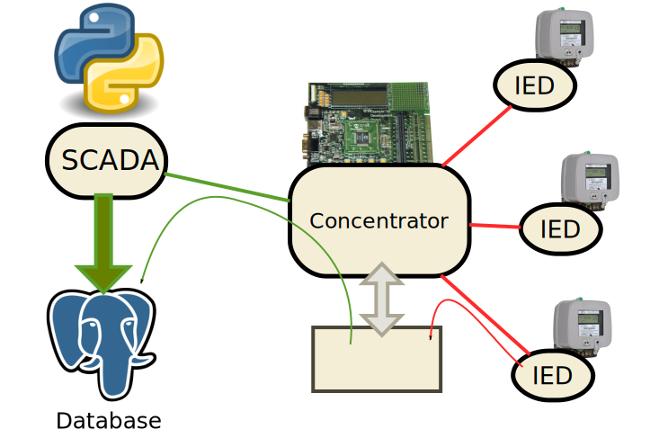

----

But how do we do it?
====================

----

Frames
======

Mara protocol is byte/word oriented. It defines 6 bytes for header and 2 for checksum.
Some payloads have bit fields

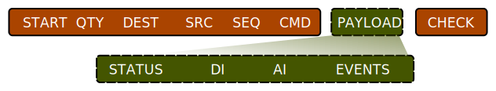

----

Let us define Mara frame as follows:

.. sourcecode:: python2

    MaraFrame = BaseMaraStruct('Mara',
            ULInt8('sof'),
            ULInt8('length'),
            ULInt8('dest'),
            ULInt8('source'),
            ULInt8('sequence'),
            ULInt8('command'),
            Optional(Payload_10),
            ULInt16('bcc')
    )

----

Let's go back to the real time thing
====================================

----

Sending updates
===============

Detecting model changes is relatively easy with signals.

The SCADA deamon is a process that run in a different address space
than the webserver or any other process.

----

.. image:: img/zmq.png

ZMQ provides many different communication patterns.

We need something that supports the **publisher/subscriber** pattern.

----

ZMQ Forwarder
=============

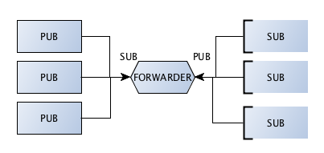

----

IPC wiht ZMQ
============

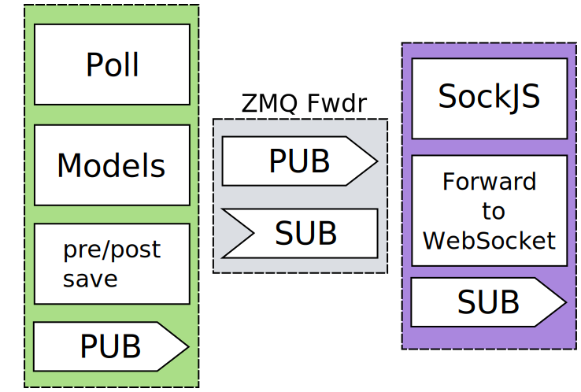

----

Showing the data in the web
===========================

----

Diagrams
========

The user of this monitoring systems needs an overview of the system.
This overview must contain **useful** information.

SVG is a great tool for this job, it's supported on major browsers and works
well on mid/high end mobile devices.

* DOM
* Properties and IDs
* jQuery SVG

----

Example SVG Diagram
===================

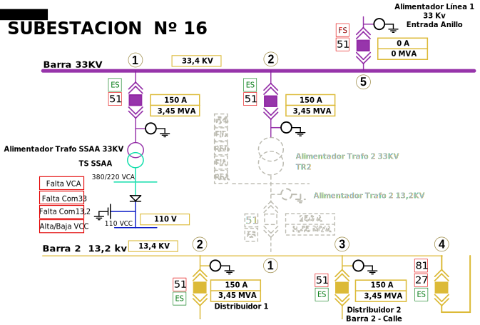

----

Formulas
========

----

Dynamic SVG
===========

DI, AI updates do not directly change properties in the diagrams,
sometimes we need 2 or 3 values in a formula to calcualate the SVG properties.

So, **every** element in SVG has an ID and an **assosiated model** in the server side.

Everytime something changes, affected formulas (elements), get recalculated
and properties updates are pushed to clients.

----

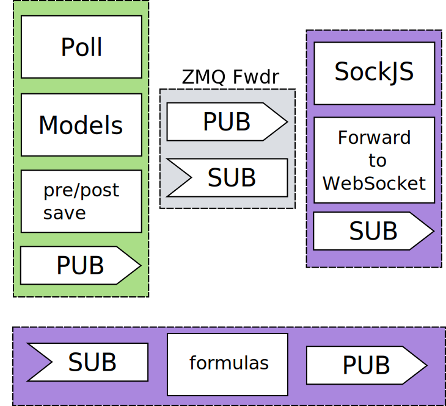

----

Infraestructure
===============

* SaaS (scada as a service)
* Use open hardware
* VPN connection to hardware

----

Questions?
==========

----

The End
=======

----

Contact
=======

Nahuel Defossé

@D3f0

nahuel.defosse (at) gmail (dot) com
