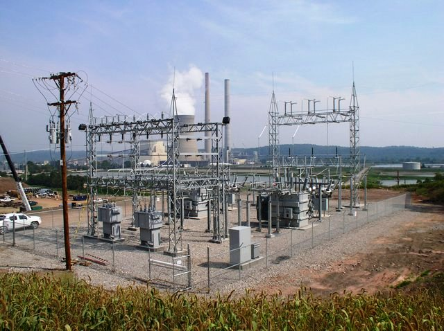
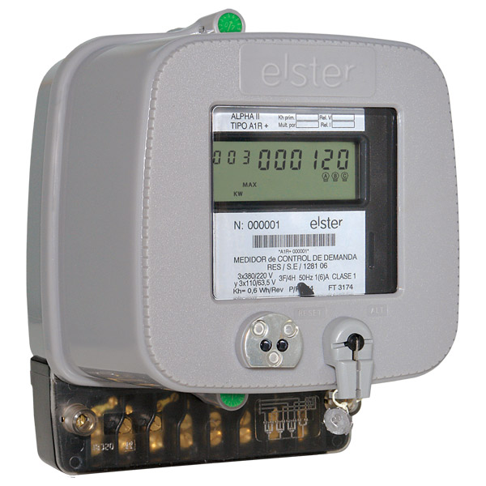
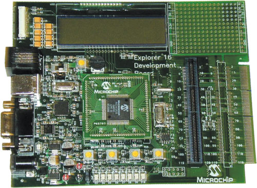
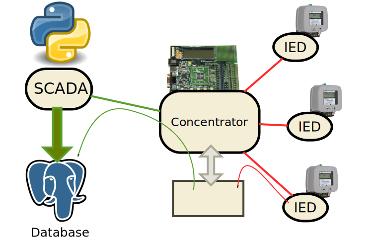

# Creando un sistema de monitoreo (web) con software libre

---
# Disclaimer

Esta charla tiene ***fuerte*** inspiración en la charla
dada en la EuroPython 2013, pero enfocada en la arquitectura
pre-realtime web.

---
## Sobre Mi

* JTP en varias materias de ARSO en UNPSJB sedes Trelew y Puerto Madryn.
* Developer at <a href="http://machinalis.com">Machinalis</a>
* Entusiaste del software libre
* Organizador sede Pto Madryn de SciPyCon Argentina 2013
* Evangelizador Python en Universidad y Secundaria (Pilas)

### Contacto
* @D3f0
* nahuel(dot)defosse(at)gmail(dot)com

---

# Que es un sistema de monitoreo

---

Un sistema de monitoreo es un SCADA *read-only*.

En el contexto de una subestación de distribución de energía eléctrica.

---

## Más específicamente...

Consiste en un mecanismo para la lectura de **variables
analógicas** (*tensión de barras, servicios auxiliares*),
**digitales** (*interruptores, seccionadores*) y
**eventos** (*protección de máxima temperatura en aceite de transofrmadores,
protecciones de sobrecorriente*).

## Especificamente

Se mide potencia real y aparente, tensión y un conjunto de estados
de diferentes hardware eléctrico.

## Transductores
La potencia es entregada por medidores (con una placa construida por ingeniería inversa),
transductores de tensión (convierten 33KV, o 13KV en una magnitud de 0 a 5V medibles
por un ADC).

---

# El hardware

1

---

# Arquitectura básica

Consta de 3 componentes arquitecturales:

* IED
* COMaster
* Centro de Monitoreo

# Meidores (IED)
Los medidores con los que se cuentan están diseñados para consulta punto a punto.
Con la adición de la placa que lee su información interna, pasamos a llamarlos IED.
Brinda una interfase RS485, sobre la cual se habla el protocolo mara.

# Concentradores Maestros (COMaster)
Existe una placa concentradora de medidas en cada estación, la cual habla en *mara*/485
con los IED y en mara/TCP hacia el centro de monitoreo.

---

# Mara

## Estructura de Mara

    [ SOF | QTY | DST | SRC | COM | ... | CRC | CRC ]

Existen comandos de:

    * Puesta en hora (0x12)
    * Configuración
    * Recolección de datos (0x10)

Ejemplo de payload de 0x10

    [ CANTVS | VS0 | VS1 | CANDIS | DI0 | DI1 | DI2 | CANAI | AI0 | AI1 ...
      CANEVS | EV1 | EV2 | EVN ]

---

# El COMaster

---

# Centro de Monitoreo

Habla Mara/TCP con cada COMaster de cada estación, lo pone en hora y le consulta
periódicamente estados y eventos.

Con los datos guardados presenta pantallas a operadores utilzando SVG.

---

# Poll

Hace las consultas de estados y eventos y los guarda en la base de datos, utilizando
el ORM de Django.

La implementación de mara en Python utiliza la librería Construct para los componentes
estructurales del protocolo y Twisted para los componentes funcionales (diagrama de
estados).

---

# HMI
La interfase HMI (Hombre Máquina) consta de un conjunto de gráficos SVG.
Existe un gráfico raíz, que tiene "links" a cada sub gráfico con mayor nive de detalle.

Los gráficos se dibujan con inkscape, asingnando un atributo **TAG** a cada
elemento (jerga eléctrica).

Luego, en una tabla de la base de datos se asignan valores de los atributos para esos
tags como "fill", "stroke" y "text".

---

# El problema de los diagramas

Lamentablemente no es posible mapear directamente una entrada **de campo** con un elemento
de pantalla. Para que un digrama se represente correctamente es necesario
un sistema de scripting.

## DSL para coloración
Excel es quizás el DSL más conocido para los ingenieros eléctricos (entre otros).
A partir de una planilla donde se asocia un tag con una formula, es fácil mediante
Python evaluar esta formula tal fuese una sentencia usando **eval** (futuramente PyParsing).

## Como son esas fórmulas

Por ejemplo

    SI(int(eg.E4289I05.text),eg.E42BAR00.stroke,12)

---
# Estructura

* Perfil
    * COMaster
        * IED
            * DI
                * Eventos
            * AI
                * Mediciones de energía
            * SV
    * Pantalla
        * Elemento gráfico
            * Formulas
    * Codigos de coloración
    * Colores

---

# Poll + Fórmulas

Cada vez que se realiza una consulta exitosa se calculan las fórmulas asociadas
a los valores recolectados.

Los resultados de las fórmulas se almacenan en la base de datos en un modelo
llamado elemento gráfico.

Cada elemento gráfico está asociado a una pantalla y a un tag, dentro de esa
pantalla.

El código JavaScript consulta ea tabla mediante una API REST.

---

# Detalles arquitecturales

## Servicios

                           (Proxy Reverso)

    Cliente >---------------> NGINX ------------> GUNICORN
                                |                   *
                                \-------            |
                                        \           |
                                      js, css       |
                                                    |
                                                    |
                            SUPERVISOR --------------
                            (monitor de             |
                            servicios)              *
                                                  POLL

---
# Conclusiones

* Django puede utilizarse en entornos poco convesionales gracias a su sistema
  de comandos.

* Las API rest permiten desacoplar la lógica del servidor de la del cliente.

* Existe una extensa varidad de librerías de JavaScript para realizar gráficas.

* SVG es muy versatil a la hora de realizar diagramas dinámico e interactivos
  sin embargo,
  es necesario un abordaje modular del código JavaScript, no basta con un
  enfoque de clausuras y manejadores de eventos (frameworks más sofisticados
  que JQuery)

* Los esquemas de formulas *excelinsiprados* liberan al ingeniero eléctrico
  de la necesidad de contrar con un programador.

---
# Mejoras

## Realtime web updates meidante middleware WSGI firendly

    Implemetación inminente

## Envío de comandos

## Control de supervisor meidante XMLRPC desde Django

## Mejoras de aplicación ClientSide:

    * Administración de paquetes
    * Framework MVC-derivado

## Implementación de DNP3, ModBus, MQTT

    Implementación inminiente

---

# DEMO

---

# Muchas Gracias