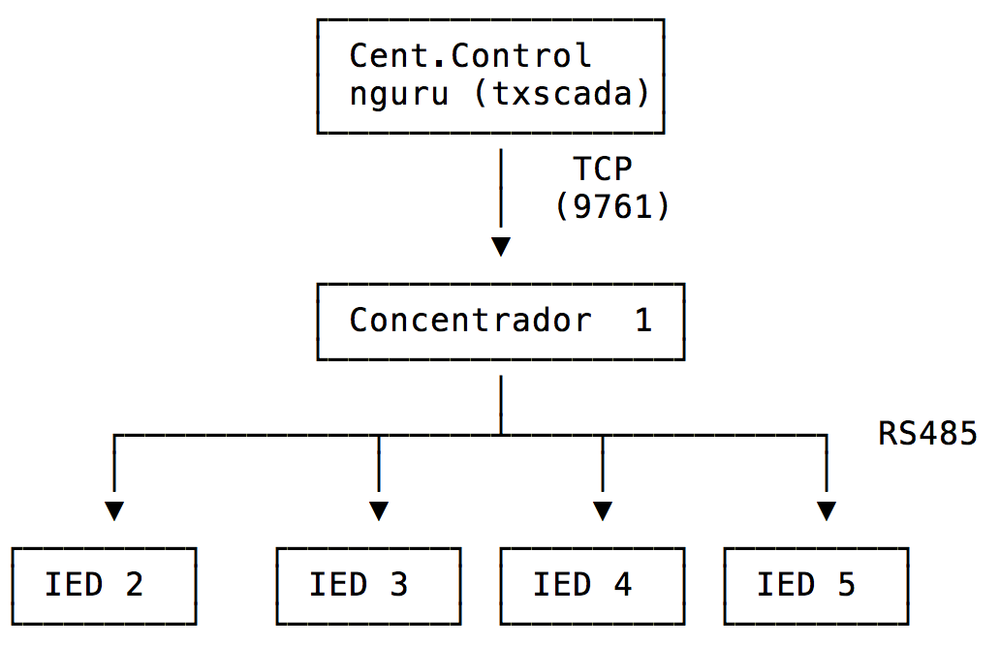

% Protocolo MARA
% Versión 1.4 (?)
% Tramas Ethernet

Conceptos básicos del sistema
-----------------------------

* Protocolo binario maestro/esclavo.
* Comunicación cliente/servidor.
* Comunicación por *polling*
* Modo RS485 multi-punto y modo punto a punto (PtP) sobre TCP.
  * Mara/RS485 entre concentrador y red de placas de campo.
  * Mara/TCP entre concentrador y centro de control (SCADA/HMI).

Esquema
-------

Mara sobre TCP
--------------
* El maestro es el cliente (`socket connect`) y el esclavo
 es el servidor (`socket accept`).
* El servidor (a.k.a. **concentrador**) escucha conexión en puerto 9761. Responde comandos Mara que envía el cliente. *Atiende un solo cliente.*

* El servidor tiene *aguas abajo* una red de placas:

  * Estas placas se comunican en Mara con el concentrador en modo multi-punto (no PtP) mediante [RS485](https://es.wikipedia.org/wiki/RS-485).
  * Estas placas realizan la función de adqusisción de datos.
  * El concentrador respalda los datos y luego envía al cliente.
a

* El cliente es un software SCADA/HMI bautizado [nguru](https://github.com/D3f0/txscada) ya que es el depredador patagónico natural de la Mara.

Estructura básica
-----------------

Ejemplo paquete de comando `0x10`, con destino `01` y origen `40`.

|     | SOF | QTY | DST | SRC | SEC | COM | BCCH | BCCL |
|-----|-----|-----|-----|-----|-----|-----|------|------|
|Valor| FE  | 08  | 01  | 40  | 80  | 10  | 80   | A7   |
|Byte |  0  |  1  |  2  |  3  |  4  |  5  |   6  |  7   |

* *SOF* Start of Frame. Indica que comienza una trama.
* *QTY* Cantidad total de bytes de la trama (hasta `0x8-0xFF`)
* *DST* Destino 1-64 (fijo en 1 para concentrador).
* *SRC* Origen 1-64 (fijo en 1 para concentrador).
* *SEC* Número de secuencia empieza en `0x20` y termina en `0x7F`.
* *COM* Comando
* *BCCH* y *BCCL* parte alta y baja de checksum

Notas sobre los campos
----------------------

* Cuando la comunicación es TCP, el destino siempre es 1 para los
  comandos. No se tiene en cuenta la dirección destino de las respuestas.
* El campo *SEQ* es incrementado por el cliente TCP (centro de control).
  Esto permite al concentador descartar buffer de retransmisión.

Comandos de Mara
----------------

* Puesta en Hora
  * `COM=0x12` y `SEC=0xBB`
  * No tiene respuesta
* Pedido de estados y eventos
  * `COM=0x10`
  * La respuesta responde 4 arreglos
    * Estados
      - SV (varsys)
      - DI
      - AI
    * Eventos
      - Digitales
      - Analógicos

Estructura de estados
---------------------

* Los estados están compuestos por

| Longitud + 1       | dato   | dato   | dato   | dato   |
|--------------------|--------|--------|--------|--------|
| can_sv  (0x05)     | byte 0 | byte 1 | byte 2 | byte 3 |
| can_di  (0x05)     | byte 0 | byte 1 | byte 2 | byte 3 |
| can_ai  (0x05)     | byte 0 | byte 1 | byte 2 | byte 3 |

* `can_sv`, `can_di`, `can_ai` son fijos y su valor es
  siempre impar ya que indica el corrimiento para llegar
  al siguiente `can_*` (+1) y la cantidad de siempre son words
  de 2 bytes.
* En el caso de no usarse alguno de los arreglos el valor sería 1 y
  y para un solo valor 3, para 2 words 5, etc.

-----

* Las SV están orientadas a bytes, siempre en cantidades pares.
  Se utilizan para diagnóstico interno (corrimiento de relojes, cantidad de resets).

* Las DI se descomponen en words de 2 bytes, componiendo el estado
  de un puerto de 16 bits. Cada DI corresponde a un IED.

  <table>
    <tr>
      <td>
        #
      </td>
      <td colspan="2">
        IED 1
      </td>
      <td colspan="2">
        IED 2
      </td>
    </tr>
    <tr>
        <td>0x05
        </td>
        <td>0xAA</td><td>0xBB</td>
        <td>0xCC</td><td>0xDD</td>

    </tr>

  </table>

Mapeo en Base de Datos
----------------------
